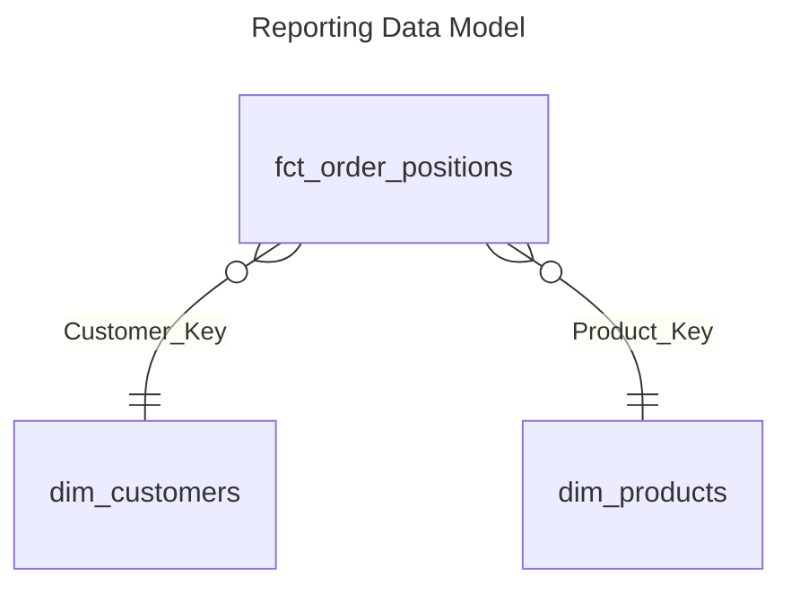

# dbt Demo

Aim of this demo is to create a simple datamart for demonstrating dbt as data transformation framework.




The data used is taken from an [e-commerce dataset](https://www.kaggle.com/datasets/olistbr/brazilian-ecommerce) from the Brazilian e-commerce platform provider *Olist*, which was published on *kaggle*.

## Download Data

Run the following code to **download the dataset**:
> Note: Needs setup kaggle API  
```bash
pipenv run python data/prepare_data.py --download
```

More information about the dataset and how to download and prepare the data could be found [here in the data folder](data/#prepare-dataset).

## Upload Data to GCS

Upload the data to Google Cloud Storage (GCS).

## Setup and Run dbt

[Read here](dbt/#dbt-core)

## Todo

* Create step for step tutorial for developing the dbt models in this project