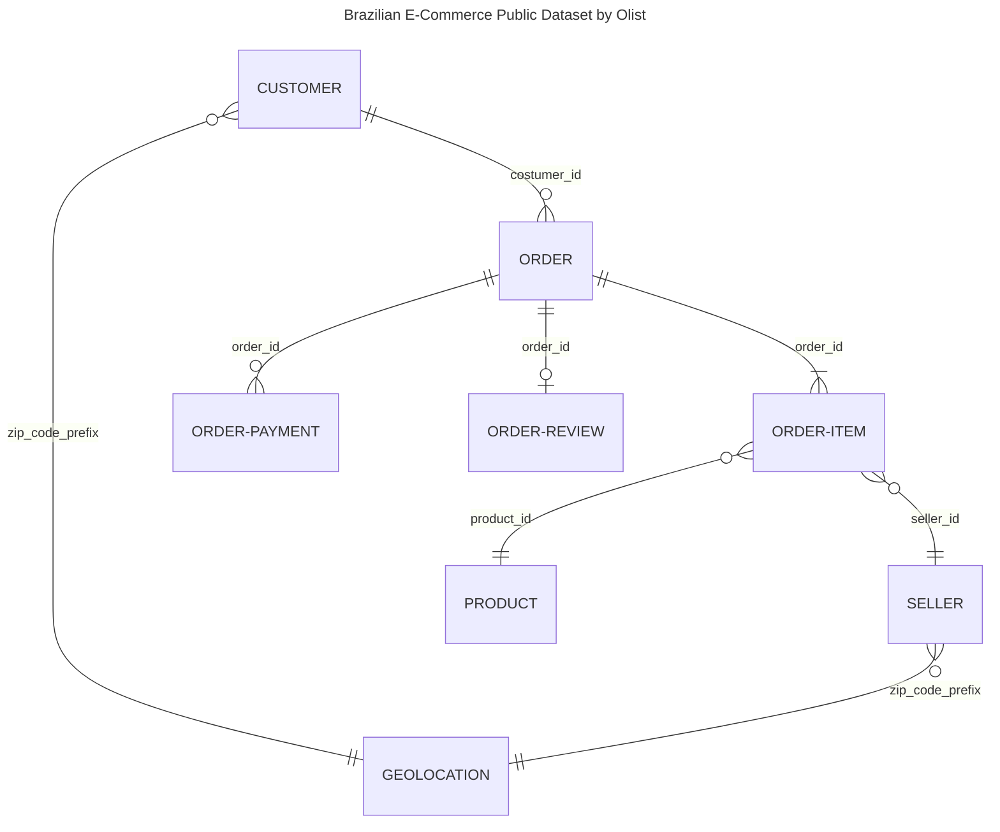

# Prepare Dataset

Follow these steps to prepare the raw data for dbt:

 1. Extract   
    1.1 [Download Dataset](#download-dataset)  
    1.2 [Convert Dataset](#12-convert-dataset)  
 2. Load  
    2.1 [Upload to GCS](#2-load-dataset)  

## 1. Extract Dataset

This demo uses an [e-commerce dataset](https://www.kaggle.com/datasets/olistbr/brazilian-ecommerce) from the Brazilian e-commerce platform provider *Olist*, which was published on *kaggle*.

The dataset contains 99.441 orders with 112.650 line items from 96.096 customers in the range from 2016-09-04 until 2018-10-17.



### 1.1 Download Dataset
> **Note:** You need a free kaggle account to download the data. If not [signup here](https://www.kaggle.com/account/login?phase=startRegisterTab).


There are two options for downloading the data:  
1. Download from website
2. Download via kaggle API

**Option 1: Download from Website**

1. Download the dataset from kaggle: https://www.kaggle.com/datasets/olistbr/brazilian-ecommerce
2. Unzip the dataset and move the csv files to a suitable location on disk.


**Option 2: Download via kaggle API**

> **Note:** This option is for experienced users who want to or have already setup the kaggle API on their computer.  
> The prerequisites are:
> * have `pipenv` installed (virtual environment of this project contains the kaggle CLI tool)
> * setup kaggle API key

***Setup kaggle API key:***  
Go to your [kaggle account](https://www.kaggle.com/me/account), scroll down to "API" and click on "Create New API Token".  
A `kaggle.json` file gets downloaded. Paste this file into `~/.kaggle`.  
```bash
mkdir -p ~/.kaggle/ 
mv ~/Downloads/kaggle.json ~/.kaggle/
chmod 600 ~/.kaggle/kaggle.json
```

*When you are using WSL and have downloaded the file on Windows, you could run this from bash inside your Linux subsystem to copy the key file to Linux:*
```bash
mkdir -p ~/.kaggle/ 
cp /mnt/c/Users/<your Windows user>/Downloads/kaggle.json -t ~/.kaggle/ 
chmod 600 ~/.kaggle/kaggle.json
```

*If you want to work on Windows: Copy the downloaded file to:*   
`C:\Users\<your Windows user>\.kaggle\kaggle.json`.

***Download Dataset***  

Run this command to download the data and convert the data in one step with this prepared script (see [1.2 Conver Dataset](#12-convert-dataset)):

```bash
pipenv run python prepare_data.py --download
```
If you run the command above, you have finished the step [1.2 Conver Dataset](#12-convert-dataset) as well already.

*Alternatively you could run this command to only download and unzip the dataset:*

```bash
pipenv run kaggle datasets download olistbr/brazilian-ecommerce -p data/ -o && unzip data/brazilian-ecommerce.zip -d data/ && rm data/brazilian-ecommerce.zip
```


### 1.2 Convert Dataset

> **Note:** Make sure you have `pipenv` installed.

Run this command to convert the data from csv files to parquet files:
```bash
pipenv run python prepare-data.py
```

## 2. Load Dataset

Upload dataset to the Google Cloud Storage bucket, which acts as data lake for this project.